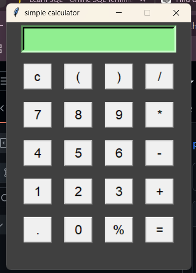

# 🧮 Simple Calculator

A simple desktop calculator application built using **Python** and **Tkinter**.

## 📸 Screenshot



## 🚀 Features

- Addition (+)
- Subtraction (-)
- Multiplication (*)
- Division (/)
- Percentage (%)
- Decimal calculations
- Parentheses for expressions
- Clear (C) button
- Error handling for invalid expressions
- Simple graphical user interface

## 🛠️ Technologies Used

- Python 3
- Tkinter

## 📂 Project Structure

```text
python-calculator/
├── README.md
└── simplecalculator/
    └── calc/
        ├── main.py
        └── calculator.png
